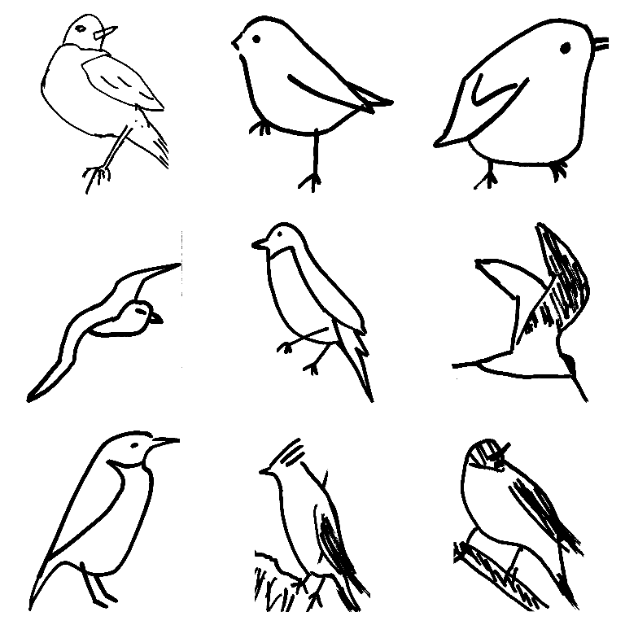

(in progress, will make it public later)

# Sketch-Guided Text-to-Image Generation (in progress)


## Introduction
Our goal is to generate photo-realistic images from given texts and freehand sketches, where texts provide the contents and sketches control the shapes. Freehand sketch can be highly abstract (examples shown below), and learning representations of sketches is not trivial. In contrast to other cross domain learning approaches, like [pix2pix](https://phillipi.github.io/pix2pix/) and [CycleGAN](https://junyanz.github.io/CycleGAN/), where a mapping from representations in one domain to those in another domain is learned, we propose to learn a joint representation of text, sketch and image. 

face                        |bird                        |shoe                        
:--------------------------:|:--------------------------:|:--------------------------:
 | |

<sub id="f1">* A few freehand sketches were collected from volunteers.</sub>

#### Contributors: 
- Major Contributor: Shangzhe Wu (HKUST), Yongyi Lu (HKUST)
- Supervisor: Yu-wing Tai (Tencent), [Chi-Keung Tang](http://www.cs.ust.hk/~cktang/) (HKUST)
- Mentor in MLJejuCamp2017: Hyungjoo Cho

### MLJejuCamp2017
Part of the project was developed in [Machine Learning Camp Jeju 2017](http://mlcampjeju.com/). More interesting projects can be found in [project descriptions](https://github.com/TensorFlowKR/MLJejuCamp) and [program GitHub](https://github.com/MLJejuCamp2017). 

## Get Started
### Prerequisites
- Python 3.5
- [Tensorflow 0.12.1](https://github.com/tensorflow/tensorflow/tree/r0.12)
- [SciPy](https://www.scipy.org/install.html)

### Setup
- Clone this repo: 
```bash
git clone https://github.com/elliottwu/sText2Image.git
cd sText2Image
```

- Download preprocessed CelebA data (~3GB): 
```bash
sh ./datasets/download_dataset.sh
```

### Train
```bash
sh train.sh
```
- To monitor training using Tensorboard, copy the following to your terminal and open `localhost:8888` in your browser
```bash
tensorboard --logdir=logs_face --port=8888
```

### Test
```bash
sh test.sh
```

### Pretrained Model
- Download pretrained model: 
```bash
sh download_pretrained_model.sh
```

- Test pretrained model on CelebA dataset: 
```bash
python test.py ./datasets/celeba/test/* --checkpointDir checkpoints_face_pretrained --maskType right --batchSize 64 --lam1 100 --lam2 1 --lam3 0.1 --lr 0.001 --nIter 1000 --outDir results_face_pretrained --text_vector_dim 18 --text_path datasets/celeba/imAttrs.pkl
```

## Experiments
We test our framework with 3 kinds of data, face([CelebA](http://mmlab.ie.cuhk.edu.hk/projects/CelebA.html)), bird([CUB](http://www.vision.caltech.edu/visipedia/CUB-200-2011.html)), and flower([Oxford-102](http://www.robots.ox.ac.uk/~vgg/data/flowers/102/index.html)). So far, we have only experimented with face images using attribute vectors as texts information. Here are some preliminary results (**to be updated**): 

### 1. Face
We used CelebA dataset, which also provides 40 attributes for each image. Similar to the text information, attributes control the specific details of the generated images. We chose 18 attrbutes for training. 

#### a). Attributes match sketch: 
The following images were generated given sketches and the **corresponding** attriubtes. 

##### Mustache
attributes   |sketch / generated / gt |attributes   | sketch / generated / gt 
:-----------:|:----------------------:|:-----------:|:-----------------------:
<sub id="f1"> Male, 5_o_Clock_Shadow, Mouth_Open, Pointy_Nose</sub> | |<sub id="f1"> Male, 5_o_Clock_Shadow, Big_Nose, Mustache</sub> |
<sub id="f1"> Male, Big_Lips, Big_Nose, Chubby, Goatee, High_Cheekbones, Smiling</sub> | |<sub id="f1"> Male, Mustache</sub> |
<sub id="f1"> Male, Goatee, Mouth_Open, Smiling</sub> | |<sub id="f1"> Male, Big_Nose, Goatee, Smiling</sub> |
<sub id="f1"> Male, 5_o_Clock_Shadow, Big_Lips, Big_Nose, Goatee, High_Cheekbones, Mouth_Open, Rosy_Cheeks, Smiling</sub> | |<sub id="f1"> Male, 5_o_Clock_Shadow, Big_Nose, Narrow_Eyes</sub> |

##### Eyeglasses
attributes   |sketch / generated / gt |attributes   | sketch / generated / gt 
:-----------:|:----------------------:|:-----------:|:-----------------------:
<sub id="f1"> Male, Big_Nose, Eyeglasses, Goatee</sub> | |<sub id="f1"> Female, Eyeglasses</sub> |
<sub id="f1"> Female, Eyeglasses, High_Cheekbones, Mouth_Open, Smiling</sub> | |<sub id="f1"> Male, 5_o_Clock_Shadow, Big_Nose, Eyeglasses, Mouth_Open, Smiling</sub> |
<sub id="f1"> Male, Big_Nose, Double_Chin, Eyeglasses, Mouth_Open, Pointy_Nose, Smiling</sub> | |<sub id="f1"> Male, Eyeglasses, High_Cheekbones, Mouth_Open, Smiling</sub> |
<sub id="f1"> Male, 5_o_Clock_Shadow, Eyeglasses, Mouth_Open, Smiling</sub> | |<sub id="f1"> Male, Big_Lips, Big_Nose, Eyeglasses, Goatee, Mouth_Open</sub> |


##### Lipstick
attributes   |sketch / generated / gt |attributes   | sketch / generated / gt 
:-----------:|:----------------------:|:-----------:|:-----------------------:
<sub id="f1"> Female, Heavy_Makeup, High_Cheekbones, Mouth_Open, Pointy_Nose, Smiling, Wearing_Lipstick</sub> | |<sub id="f1"> Female, Heavy_Makeup, Mouth_Open, Wearing_Lipstick</sub> |
<sub id="f1"> Female, Heavy_Makeup, High_Cheekbones, Mouth_Open, Pointy_Nose, Smiling, Wearing_Lipstick</sub> | |<sub id="f1"> Female, Heavy_Makeup, Pointy_Nose, Smiling, Wearing_Lipstick</sub> |
<sub id="f1"> Female, Heavy_Makeup, High_Cheekbones, Mouth_Open, Pointy_Nose, Smiling, Wearing_Lipstick</sub> | |<sub id="f1"> Female, Big_Lips, Big_Nose, Heavy_Makeup, High_Cheekbones, Mouth_Open, Rosy_Cheeks, Smiling, Wearing_Lipstick</sub> |
<sub id="f1"> Female, Heavy_Makeup, Pointy_Nose, Wearing_Lipstick</sub> | |<sub id="f1"> Female, Heavy_Makeup, Mouth_Open, Smiling, Wearing_Lipstick</sub> |

#### b). Attributes mismatch sketch: 
The following images were generated given sketches and the **random** attriubtes. The controlling effects of the attributes are still under improvement. 

attributes   |sketch / generated / gt |attributes   | sketch / generated / gt |attributes   | sketch / generated / gt 
:-----------:|:----------------------:|:-----------:|:-----------------------:|:-----------:|:-----------------------:
<sub id="f1"> Female, Big_Lips, Heavy_Makeup, Wearing_Lipstick</sub> | |<sub id="f1"> Female, Big_Lips, Heavy_Makeup, Wearing_Lipstick</sub> | |<sub id="f1"> Male, Big_Nose</sub> |
<sub id="f1"> Male, Big_Nose, Chubby, Double_Chin, High_Cheekbones, Smiling</sub> | |<sub id="f1"> Male, Big_Nose, Chubby, Double_Chin, High_Cheekbones, Mouth_Open, Smiling</sub> | |<sub id="f1"> Female, Heavy_Makeup, High_Cheekbones, Mouth_Open, Smiling, Wearing_Lipstick</sub> |
<sub id="f1"> Female, Heavy_Makeup, High_Cheekbones, Mouth_Open, Smiling, Wearing_Lipstick</sub> | |<sub id="f1"> Female, Heavy_Makeup, High_Cheekbones, Mouth_Open, Smiling, Wearing_Lipstick</sub> | |<sub id="f1"> Female, Heavy_Makeup, High_Cheekbones, Mouth_Open, Smiling, Wearing_Lipstick</sub> |
<sub id="f1"> Female, Heavy_Makeup, High_Cheekbones, Mouth_Open, Smiling, Wearing_Lipstick</sub> | |<sub id="f1"> Male</sub> | |<sub id="f1"> Female, Heavy_Makeup, Pale_Skin, Wearing_Lipstick</sub> |
<sub id="f1"> Female, Heavy_Makeup, High_Cheekbones, Pointy_Nose, Smiling, Wearing_Lipstick</sub> | |<sub id="f1"> Female, Heavy_Makeup, High_Cheekbones, Pointy_Nose, Smiling, Wearing_Lipstick</sub> | |<sub id="f1"> Female, Heavy_Makeup, High_Cheekbones, Mouth_Open, Pointy_Nose, Rosy_Cheeks, Smiling, Wearing_Lipstick</sub> |
[comment]: < <sub id="f1"> Female, Heavy_Makeup, High_Cheekbones, Pointy_Nose, Smiling, Wearing_Lipstick</sub> | >

## Acknowledgement
Codes are based on [DCGAN](https://github.com/carpedm20/DCGAN-tensorflow) and [dcgan-completion](https://github.com/bamos/dcgan-completion.tensorflow). 
