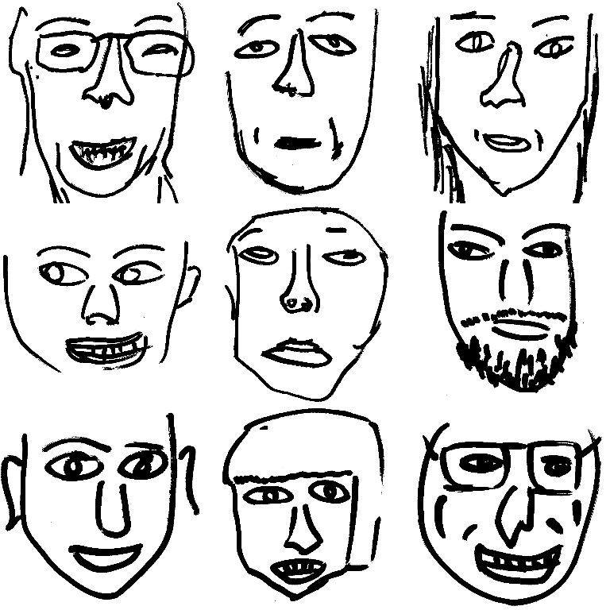
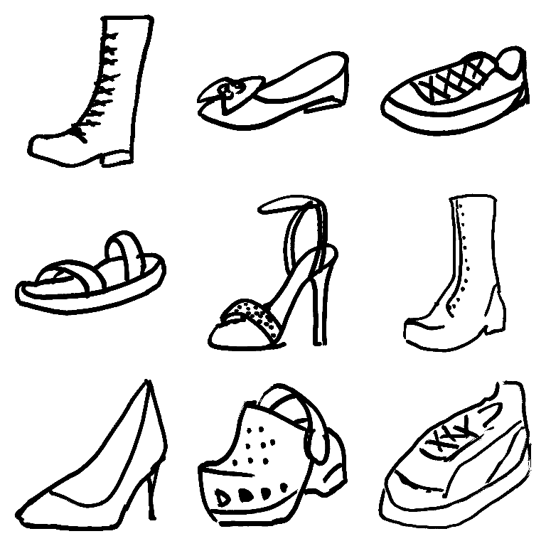

(in progress, will make it public later)

# sText2Image (in progress)

Sketch-Guided Text-to-Image Generation (part of the project was developed in [MLJejuCamp2017](http://mlcampjeju.com/))

## Introduction
Our goal is to generate photo-realistic images from given texts and freehand sketches, where texts provide the contents and sketches control the shape. Freehand sketch can be highly abstract (examples<sup id="a1">[1](#f1)</sup> shown below), and learning representations of sketches is not trivial. In contrast to other cross domain learning approaches, like [pix2pix](https://phillipi.github.io/pix2pix/) and [CycleGAN](https://junyanz.github.io/CycleGAN/), where a mapping from representations in one domain to those in another domain is learned, we propose to learn a joint representation of text, sketch and image. 

face                        |bird                        |shoe                        
:--------------------------:|:--------------------------:|:--------------------------:
 | |

<sub id="f1">* A few freehand sketches were collected from volunteers.[↩](#a1)</sub>

#### Contributors: 
- Major Contributor: Shangzhe Wu (HKUST), Yongyi Lu (HKUST)
- Supervisor: Yu-wing Tai (Tencent), [Chi-Keung Tang](http://www.cs.ust.hk/~cktang/) (HKUST)
- Mentor in MLJejuCamp2017: Hyungjoo Cho

### MLJejuCamp2017
More interesting projects can be found in Machine Learning Camp Jeju 2017 [project descriptions](https://github.com/TensorFlowKR/MLJejuCamp) and [program github](https://github.com/MLJejuCamp2017). 

## Get Started
### Prerequisites
- Python 3.5
- [Tensorflow 0.12.1](https://github.com/tensorflow/tensorflow/tree/r0.12)
- [SciPy](https://www.scipy.org/install.html)

### Setup
- Clone this repo: 
```bash
git clone https://github.com/elliottwu/sText2Image.git
cd sText2Image
```

- Download preprocessed CelebA data: 
```bash
sh ./datasets/download_dataset.sh
```

### Train
```bash
sh train.sh
```
- To monitor training using Tensorboard, copy the following to your terminal and open `localhost:8888` in your browser
```bash
tensorboard --logdir=logs_face --port=8888
```

### Test
```bash
sh test.sh
```

### Pretrained Model
- Download pretrained model:
```bash
wget https://storage.googleapis.com/stext2image/face_pretrained.tar.gz
tar xzvf face_pretrained.tar.gz 
```

- Test pretrained model: 
```bash
python test.py ./datasets/celeba/test/* --checkpointDir checkpoints_face_pretrained --maskType right --batchSize 64 --lam1 100 --lam2 1 --lam3 0.1 --lr 0.001 --nIter 1000 --outDir results_face_pretrained --text_vector_dim 18 --text_path datasets/celeba/imAttrs.pkl
```

## Experiments
We test our framework with 3 kinds of data, face([CelebA](http://mmlab.ie.cuhk.edu.hk/projects/CelebA.html)), bird([CUB](http://www.vision.caltech.edu/visipedia/CUB-200-2011.html)), and flower([Oxford-102](http://www.robots.ox.ac.uk/~vgg/data/flowers/102/index.html)). So far, we have only experimented with face images using attribute vectors as texts information. Here are some preliminary results (**to be updated**): 

## Acknowledgement
Codes are based on [DCGAN](https://github.com/carpedm20/DCGAN-tensorflow) and [dcgan-completion](https://github.com/bamos/dcgan-completion.tensorflow). 
